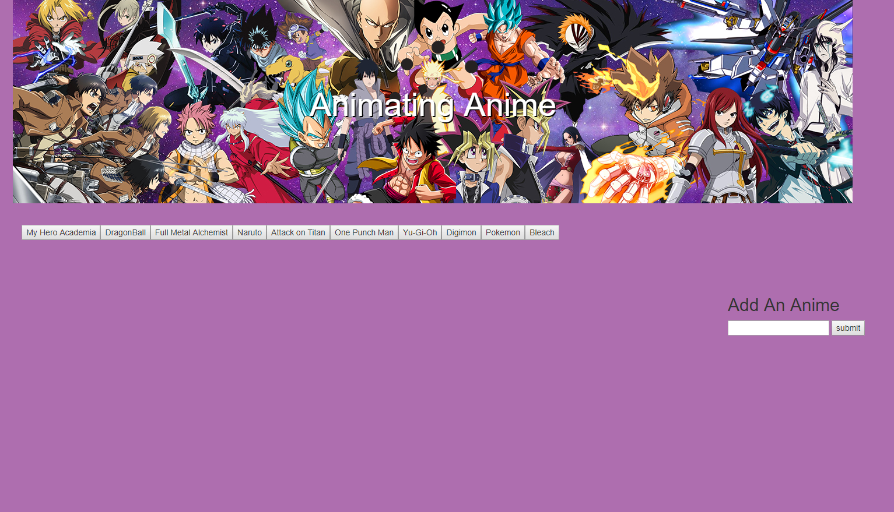
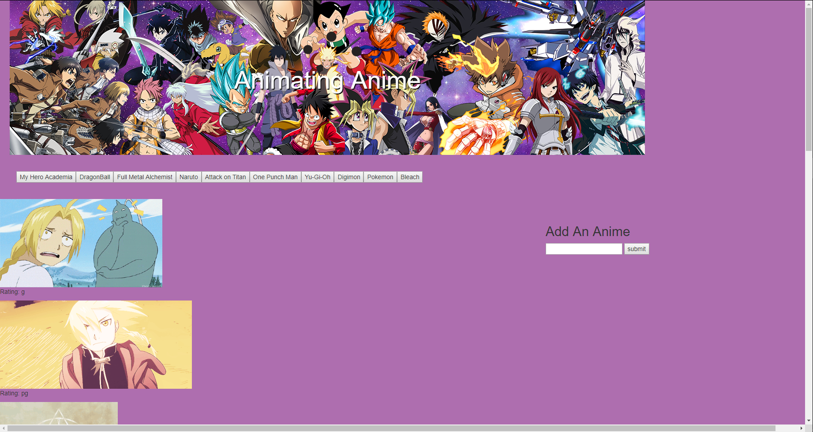
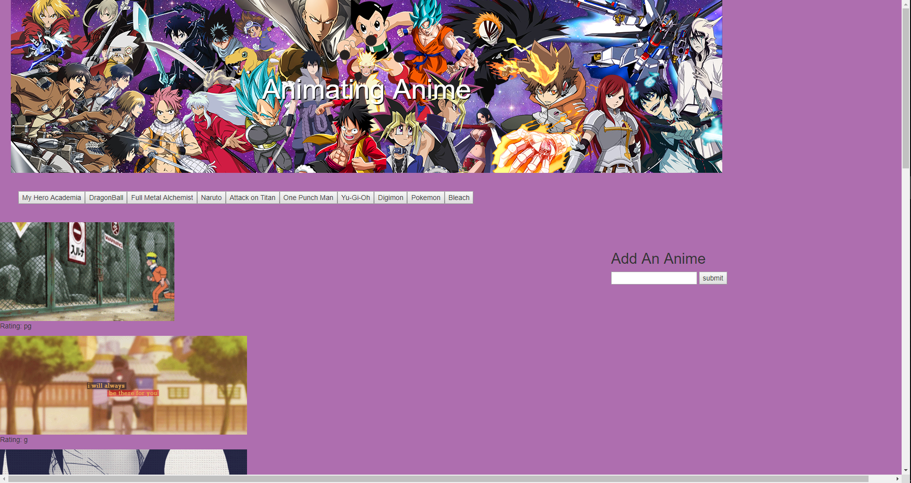
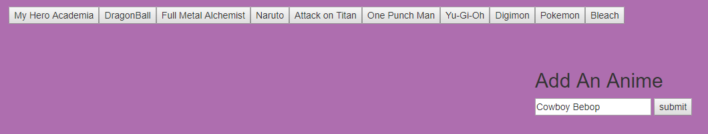
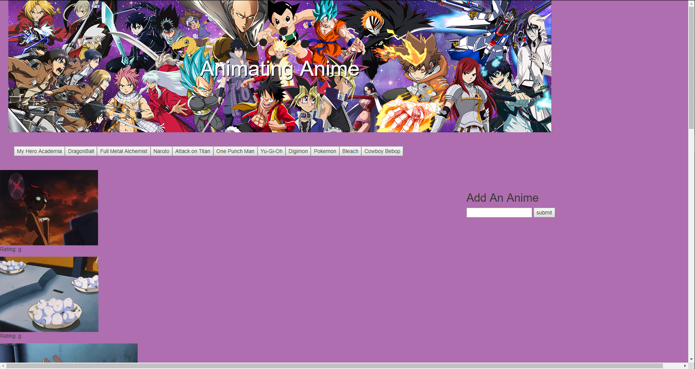

# GIF Generator: Animating Anime

The name even sounds like an anime episode title. 

## Purpose

The purpose of this assignment was to learn the concepts of AJAX (Asynchronous JavaScript And XML), JSON (JavaScript Object Notation) and APIs (Application Programming Interfaces). Using an API from Giphy, I could call upon information from their website pertaining to GIFs via an AJAX request. The information is made both meaningful and usable by a JSON, or an object holding the information of Giphy's database of GIFs.

## How It Works 

When the page loads, a function generates a series of buttons from a pre-made array to an existing div in the HTML file. 

Upon clicking one of those buttons, 10 paused GIFs related to the topic selected will be generated below to a prexisting div by making an ajax request to Giphy. Clicking a GIF once will cause it to animate. Clicking a GIF that is currently animating will pause it.

If another button is pressed, the GIFs in the div are completely removed, and a new set of GIFs will be generated for in their place.

More buttons can be added in the search box on the right side of the page, of which can then be pressed to generate another 10 GIFs for the topic it's labeled for.

"Let's add a Cowboy Bebop button."

"Now let's click it!"

"Cue the catchy theme music."

**NOTE:** Refreshing the page will remove any buttons that were added by the user, as there is no database that retaining this information. 

## Notes for Improvement

I would like to improve the CSS for this application for improved user experience. 

Additionally, the GIFs that are generated are completely up to what Giphy can find for the given topic inserted. This can lead to certain GIFs appearing that aren't actually related to what was sought. If possible, I would like to increase the accuracy of the GIFs generated.

For supplemental functionality, adding a function to generate the subsequent 10 GIFs in the JSON would make finding GIFs more easy and fruitful. 

## Links

To see the page immediately: https://virtualvasquez.github.io/Ajax-Gifs/

## Technologies Used

* HTML
* CSS
* Bootstrap
* Javascript
* jQuery
* AJAX
* API
* JSON
* Giphy

